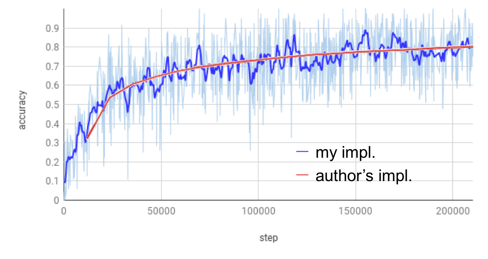

# Adversarial Pose Estimation
This repository implements pose estimation methods in PyTorch.

## Data
The file `data/lsp_mpii.h5` contains the annotations of MPII, LSP training data and LSP test data.  
Place LSP, MPII images in `data/LSP/images` and `data/mpii/images`.  
Place coco annotations in `data/coco/annotations` and images in `data/coco/images`, as suggested by [cocoapi](https://github.com/cocodataset/cocoapi). The file `valid_id` contains the image_ids used for validation.

## Folder Structure
- `data`: put the training / testing data here
- `src`:
    - `models`: model definition
    - `datasets`: dataset definition
    - `extensions`:
        - `AE`: code from [Associative Embedding](https://github.com/umich-vl/pose-ae-train).  
        torch.autograd.Function extension for computing the loss.
    - `utils`  

All the other folders represents different tasks. Each contains a training script `train.py` and definition of command-line options `opts.py`.
- `hgpose`: training code for [Stacked Hourglass Networks for Human Pose Estimation](https://arxiv.org/abs/1603.06937). Single-Person.

- `hgpose-ae`: training code for [Associative Embedding: End-to-end Learning for Joint Detection and Grouping](https://arxiv.org/abs/1611.05424). Multi-Person

- `advpose`: training code for [Self Adversarial Training for Human Pose Estimation](https://arxiv.org/abs/1707.02439). Single-Person.

- `advpose-ae`: training code combining `advpose` with `AE_loss`. Multi-Person.

## Known Issues
- `advpose-ae`: Only supports single gpu. Multi-gpu training get stucked randomly. The problem seems to be caused by the AE_loss extension. 

## TODOs
- [ ] visualization
