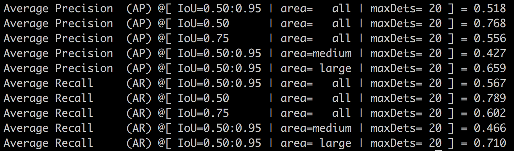

# Adversarial Pose Estimation
This repository implements pose estimation methods in PyTorch.

## Getting Started
### Data
The file [lsp_mpii.h5](data/lsp_mpii.h5) contains the annotations of MPII, LSP training data and LSP test data.  
Place LSP, MPII images in `data/LSP/images` and `data/mpii/images`.  
Place coco annotations in `data/coco/annotations` and images in `data/coco/images`, as suggested by [cocoapi](https://github.com/cocodataset/cocoapi). The file [valid_id](data/coco/valid_id) contains the image_ids used for validation.

### Compile the extension
Compile the C implementation of the associative embedding loss. Code credit [umich-vl/pose-ae-train](https://github.com/umich-vl/pose-ae-train).
```
cd src/extensions/AE
python build.py  # be sure to have visible cuda device
```


## Folder Structure
- `data`: put the training / testing data here
- `src`:
    - `models`: model definition
    - `datasets`: dataset definition
    - `extensions`:
        - `AE`: code from [Associative Embedding](https://github.com/umich-vl/pose-ae-train).  
        torch.autograd.Function extension for computing the loss.
    - `utils`  

All the other folders represents different **tasks**. Each contains a training script `train.py` and definition of command-line options `opts.py`.
- `hgpose`: training code for [Stacked Hourglass Networks for Human Pose Estimation](https://arxiv.org/abs/1603.06937). Single-Person.

- `hgpose-ae`: training code for [Associative Embedding: End-to-end Learning for Joint Detection and Grouping](https://arxiv.org/abs/1611.05424). Multi-Person.s  
**COCO test compare**, test on the images in [valid_id](data/coco/valid_id) 
<figure style="display:table">
    
    <figcaption style="display:table-caption;caption-side:bottom">Author's pretrained checkpoint. 362 epochs with batch_size 32, 1000 iters per epoch and lr decay from 2e-4 to 1e-5 at 200000 iters.</figcaption>
</figure>
<figure style="display:table">
    
    <figcaption style="display:table-caption;caption-side:bottom">My training result at 150 epochs with batch_size 16, 2465 iters per epoch and consistent lr of 2e-4. Roughly equals to half the progress of author's pretrained checkpoint.</figcaption>
</figure>

- `advpose`: training code for [Self Adversarial Training for Human Pose Estimation](https://arxiv.org/abs/1707.02439). Single-Person.

<figure>
    
    <figcaption>Comparison of training accuracy over steps</figcaption>
</figure>

- `advpose-ae`: training code combining `advpose` with `AE_loss`. Multi-Person.


## Known Issues
- `advpose-ae`: Only supports single gpu. Multi-gpu training get stucked randomly. The problem seems to be caused by the AE_loss extension. 

## TODOs
- [ ] visualization
- [ ] example of usage